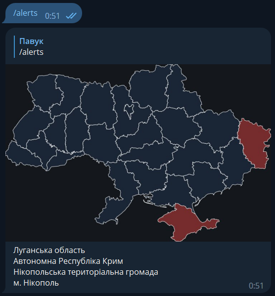

# Alerts_in_ua.py

Бібліотека для користування API сайту [alerts.in.ua](https://alerts.in.ua).
**Бібліотека досі в розробці, якщо ви знайшли помилку або у вас є ідея щодо бібліотеки,
звертайтеся до розробника!** Telegram: [@FOUREX_dot_py](https://t.me/FOUREX_dot_py).

Розробники сайту [alerts.in.ua](https://alerts.in.ua/) випустили
[офіційну бібліотеку](https://github.com/alerts-ua/alerts-in-ua-py).

## Приклад використання:

```python
from alerts_in_ua.alerts_client import AlertsClient  # Імпортуємо клієнт

alerts_client = AlertsClient("token")  # Ініціалізуємо клієнт


def main():
    locations = alerts_client.get_active()  # Отримуємо список місць з тривогою

    # Фільтруємо список місць залишаючи місця з ПОВІТРЯНОЮ тривогою
    air_raid_locations = locations.filter(alert_type="air_raid")

    for location in air_raid_locations:
        # Виводимо назву та час початку тривоги кожного місця зі списку
        print(location.location_title, location.started_at)


if __name__ == "__main__":
    main()
```

## Приклад використання асинхронного клієнта:
Рекомендовано використовувати для ботів

```python
import asyncio

from alerts_in_ua.async_alerts_client import AsyncAlertsClient

alerts_client = AsyncAlertsClient("token")  # Ініціалізуємо клієнт


async def main():
    locations = await alerts_client.get_active()  # Отримуємо список місць з тривогою

    # Фільтруємо список місць залишаючи місця з ПОВІТРЯНОЮ тривогою
    air_raid_locations = locations.filter(alert_type="air_raid")

    for location in air_raid_locations:
        # Виводимо назву та час початку тривоги кожного місця зі списку
        print(location.location_title, location.started_at)


if __name__ == "__main__":
    loop = asyncio.new_event_loop()
    loop.run_until_complete(main())
```

## Приклад використання рендера мапи тривог:
Для телеграм боту написаного з допомогою бібліотеки [aiogram](https://github.com/aiogram/aiogram)
```python
from aiogram import Bot, Dispatcher, executor
from aiogram.types import Message

from alerts_in_ua.async_alerts_client import AsyncAlertsClient
from alerts_in_ua.location import Location


bot = Bot("telegram_bot_token")
dp = Dispatcher(bot)

alerts_client = AsyncAlertsClient("api_alerts_in_ua_token")


@dp.message_handler(commands=["alerts"])
async def yep(message: Message):
    locations = await alerts_client.get_active()
    alerts_map = locations.render_map()
    message_text = "\n".join(locations.location_title)

    await message.reply_photo(alerts_map, message_text)


if __name__ == "__main__":
    executor.start_polling(dispatcher=dp)
```

Результат:



## Використання фільтрів:
Спосіб 1
```python
locations = alerts_client.get_active()

air_raid = locations.filter(alert_type="air_raid")
oblast = locations.filter(location_type="oblast")
air_raid_and_oblast = locations.filter(alert_type="air_raid", location_type="oblast")

print(air_raid)  # Місця лише з повітряною тривогою
print(oblast)  # Лише області
print(air_raid_and_oblast)  # Лише області з повітряною тривогою
```
Спосіб 2
```python
locations = alerts_client.get_active()

air_raid_filter = {"alert_type": "air_raid"}
oblast_filter = {"location_type": "oblast"}
air_raid_and_oblast_filter = {"alert_type": "air_raid", "location_type": "oblast"}

air_raid = locations.filter(**air_raid_filter)
oblast = locations.filter(**oblast_filter)
air_raid_and_oblast = locations.filter(**air_raid_and_oblast_filter)

print(air_raid)  # Місця лише з повітряною тривогою
print(oblast)  # Лише області
print(air_raid_and_oblast)  # Лише області з повітряною тривогою
```

## Отримання значень атрибутів місць через список місць:
```python
locations = alerts_client.get_active()

print(list(zip(locations.location_title, locations.location_uid)))
# [('Луганська область', '16'), ('Автономна Республіка Крим', '29'), ('Нікопольська територіальна громада', '351'), ('м. Нікополь', '5351')]
```

## Перевірка наявності місця в списку:
За його UID (location_uid) або назвою (location_title)

```python
locations = alerts_client.get_active()
print("Автономна Республіка Крим" in locations)
```
